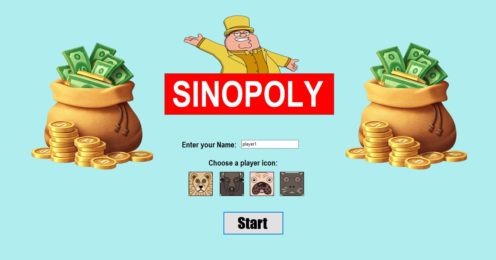
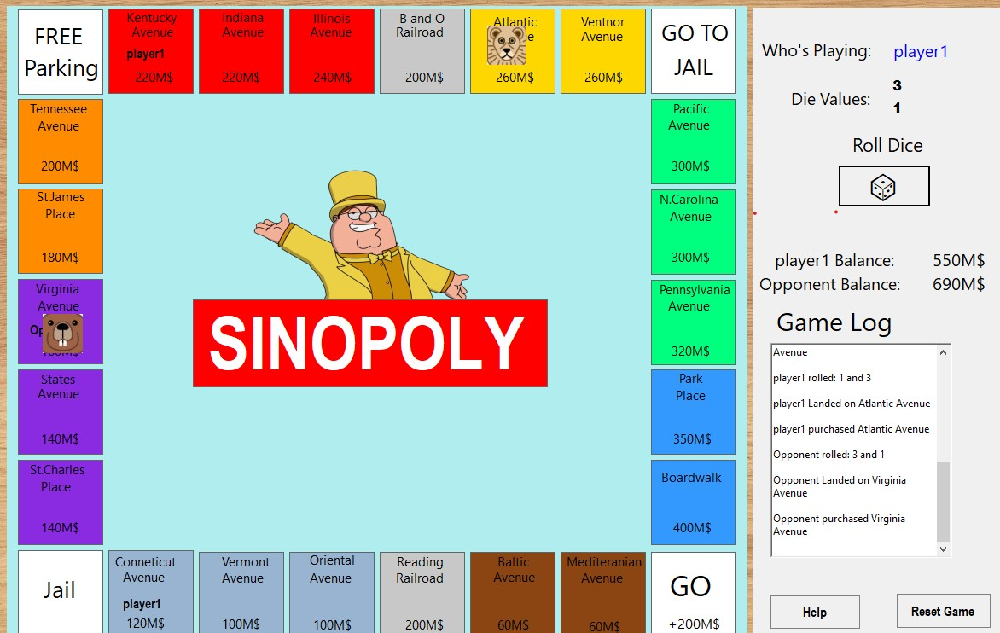

# SINOPOLY

A simplified Monopoly-inspired board game developed in **C# using Windows Forms** as a school project for the **Höhere Berufsfachschule IT (Germany)**. The game is played by one human player against a basic AI opponent and includes the core mechanics of Monopoly such as buying properties, paying rent, railroads, jail, and passing GO.

## Screenshots

### Main Menu

### Gameplay

---

## Project Overview

The goal of this project was to practice object-oriented programming and GUI development using Windows Forms. Instead of recreating Monopoly exactly, I implemented a simplified version that focuses on the core gameplay mechanics while keeping the project manageable.

The player competes against an AI opponent, buying properties, collecting rent, and trying to finish with more money than the opponent.

---

## Features

* One player vs AI gameplay
* Custom Windows Forms game board
* Random dice rolls using a random number generator
* Buy unowned properties
* Pay rent when landing on an opponent's property
* Railroads
* GO space (+200M$)
* Jail and Free Parking
* "Go To Jail" tile
* Three consecutive doubles send the player to jail
* Property ownership display
* Player balances
* Game log showing all actions
* Reset game option
* Different player icons

---

## AI Behavior

The AI automatically makes all of its decisions.

When it lands on an unowned property, it will purchase it **only if it has at least 200M$ remaining after buying the property**. This is a simple strategy that prevents the AI from spending all of its money too early.

---

## How to Run

### Requirements

* Visual Studio
* .NET Framework 8.0

### Running the Project

1. Clone or download the repository.
2. Open the solution (`.sln`) in Visual Studio.
3. Build the project.
4. Run the application.

---

## Design

The project was built using **C#** and **Windows Forms**.

Most of the game logic is separated from the graphical interface, while the GUI handles displaying the board, player information, and user interaction.

The board itself was created manually using Windows Forms controls instead of using a Monopoly board image.

---

## Challenges

The most difficult part of this project was creating the game board.

Initially, I tried using a Monopoly board image as the background of a `TableLayoutPanel`, but this caused rendering and alignment problems. Because of this, I decided to build the board manually using Windows Forms controls.

Another challenging part was creating the movement animation so that the player's token moves one space at a time instead of instantly jumping to the destination.

---

## Limitations

This is a simplified version of Monopoly and does **not** include every official rule.

Missing features include:

* Houses and hotels
* Property trading
* Chance cards
* Community Chest cards
* Multiplayer over a network or local multiplayer
* More advanced AI strategy

Dice rolling is also simplified by using a random number generator rather than a graphical dice animation.

---

## What I Learned

Through this project I gained experience with:

* C# programming
* Windows Forms GUI development
* Object-oriented programming
* Event-driven programming
* Managing game state
* Designing simple AI behavior
* Debugging GUI rendering and animation issues

---

## Future Improvements

Possible improvements include:

* Smarter AI strategy
* Houses and hotels
* Chance and Community Chest cards
* Better animations
* Sound effects
* Improved graphics
* Save and load functionality
* Online or local multiplayer support

---

## Disclaimer

This project was created for educational purposes as part of a programming course at the **Höhere Berufsfachschule IT**. It is inspired by Monopoly but is a simplified implementation made for learning object-oriented programming and Windows Forms development.
